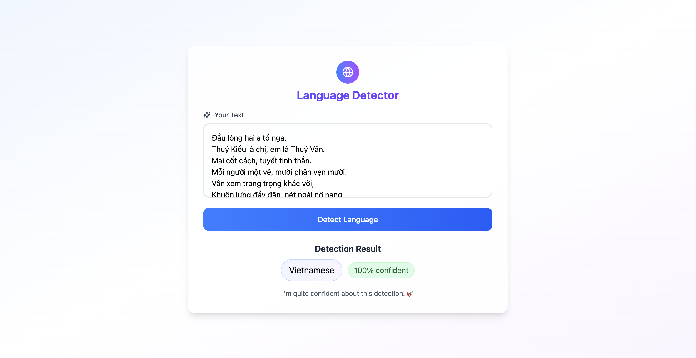

# Language Detection with BERT

A full-stack application that fine-tunes a multilingual BERT model for real-time language identification, with a sleek React frontend and a robust FastAPI backend.

## Key Features
- Fine-tuned google-bert/bert-base-multilingual-cased on the papluca/language-identification dataset for high-accuracy language detection.
- FastAPI-powered REST endpoints deliver predictions in milliseconds.
- Responsive React UI with live input and result display.

## Output Demo


## Tech Stack
- Training Pipeline: Python, PyTorch, Transformers, Datasets, Evaluate, NumPy, argparse
- Backend: Python, FastAPI 
- Frontend: React, TypeScript, Tailwind CSS


## Reproduction
To reproduce this project locally, follow these steps:

1. **Clone the repository**  
   ```bash
   git clone https://github.com/juzieeheyhey/language-detection.git
   cd language-detection
    ```

2. **Set up the backend**
    ```bash
    cd backend
    python -m venv venv
    source venv/bin/activate   
    pip install -r requirements.txt
    uvicorn app.main:app --reload
    ```

3. **Set up the frontend**
    ```bash
    cd ../frontend
    npm install
    npm start
    ```
